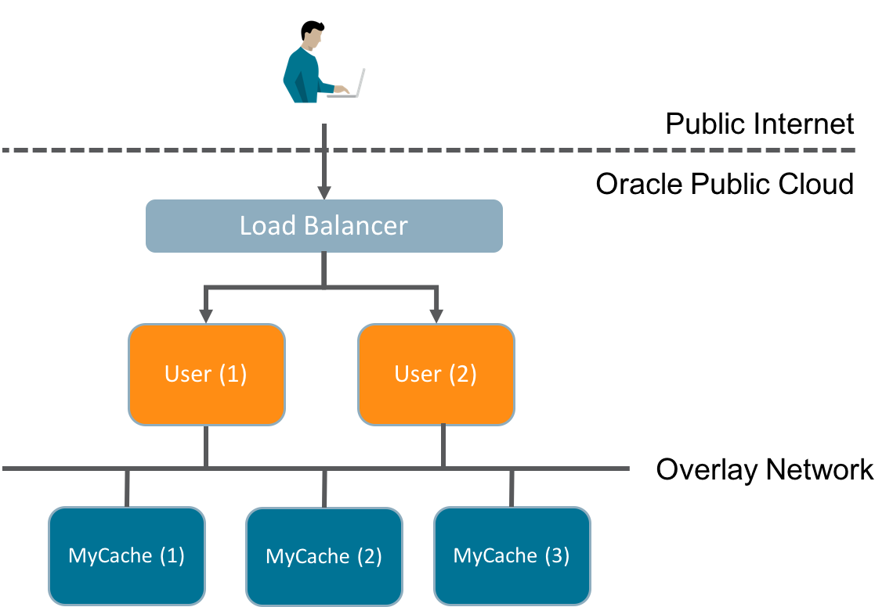
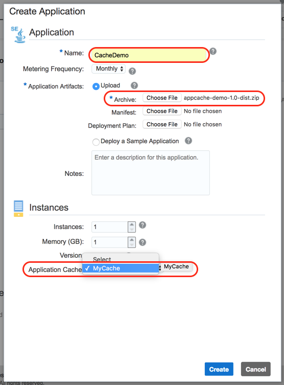
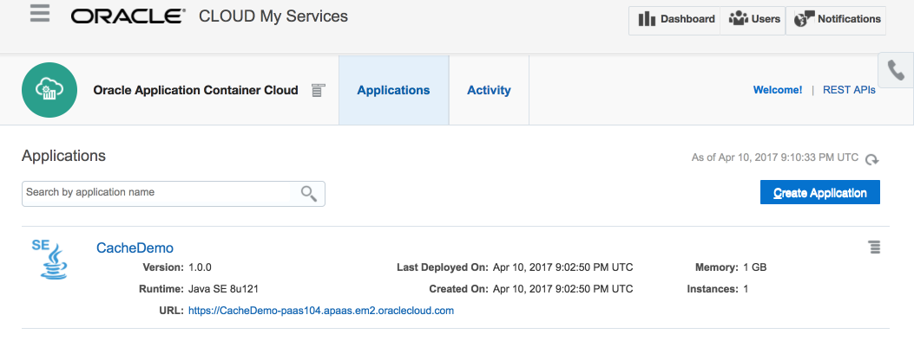

Oracle Application Container Cloud: Introducing the Application Cache Java API
==============================================================================

The [Oracle Application Container Cloud (ACCS)](http://cloud.oracle.com/acc)'s Application Cache provides (as the name implies) caching for applications!  You simply specify the amount of RAM you want and whether you just need basic non-HA cache for dev/test or reliable caching for production and the appropriate infrastructure is automatically provisioned.  

Under the Hood
--------------
The ACCS Application Cache is built on the highly performant and scalable [Oracle Coherence](http://www.oracle.com/technetwork/middleware/coherence/overview/index.html) in-memory data grid that's been powering trading and other memory and time sensitive applications for years.  In the ACCS Application Cache, the underlying Coherence implementation is not exposed but if you need a true in-memory data grid cloud service don't worry, Oracle is working on exactly that.  In the meantime, the Coherence team continues to innovate.  For example here's the Coherence team's [Brian Oliver speaking at Oracle Code in on distributed streams](https://youtu.be/9yt43EIDJmg).

That's a little about the amazing engine that's under the hood, but let's get back to the main topic.

Java Caching
------------

The Application Cache was initially released with a language independent REST API, but to make it easier for Java applications to leverage caching a new native Java API was created.  In addition to simplifying cache usage from Java, the API also adds the option of [GRPC](http://www.grpc.io/) for efficient data transfer between caches and clients. The client API is an open source framework with sources hosted on [GitHub](https://github.com/oracle/accs-caching-java-sdk) and binaries both directly downloadable and available through Maven Central.

To introduce the Java client API I'll go over usage basics, introduce a simple example that illustrates usage in a working application, and then show how to deploy the example to Application Container Cloud.

Background
----------

If you're not familiar with the ACCS Application Cache feature you can learn more with with these resources:

* Book: [Using Caches in Oracle Application Container Cloud Service](http://docs.oracle.com/en/cloud/paas/app-container-cloud/cache/index.html)
* Tutorial: [Create a Java application using the Caching REST API in Oracle Application Container Cloud Service](http://www.oracle.com/webfolder/technetwork/tutorials/obe/cloud/apaas/java/java-accs-caching-basic/java-accs-caching-basic.html)
* Tutorial: [Creating a Node.js Application Using the Caching REST API in Oracle Application Container Cloud Service](http://www.oracle.com/webfolder/technetwork/tutorials/obe/cloud/apaas/node/node-accs-caching-basic/node-accs-caching.html#overview)

Cache API Basics
----------------

To access a cache using the Java client API there are a few simple steps:

1. Create a SessionProvider for a given Application Cache that you've previously created providing a URL with its name and the port that supports the desired transport protocol: 1444 for GRPC, 8080 for REST.  When using REST, the cache hostname is followed by "/ccs".

    `SessionProvider sessionProvider = new RemoteSessionProvider("http://MyCache:1444");`

2. Obtain a Session from the SessionProvider using a specific transport

    `Session cacheSession = sessionProvider.createSession(Transport.grpc());`

3. Obtain a specific Cache object from the Session

    `Cache<Users> users = cacheSession.getCache("users");`

Using the Application Cache
---------------------------

The application cache includes operations to get, put, replace, and remove items.  Each of these operations is included in the example which provides a very simple User management REST service using the [Java Spark](http://sparkjava.com/) framework.  At the backend of the example is the `UserService` that provides User create/update/delete operations which are implemented using the Application Cache Java client API.  For example, the code to put a User object into the `users` cache with its id as the key is:

`users.put(user.getId(),user);`

Removing an object from a cache can be as simple as calling `users.remove(id)` but because caches are not local the remove API provides optimization options.  The JDK's `java.util.Map.remove()` method returns the object being removed (if it exists) but you may just want to remove the object and not pay the cost of transporting the object from the cache back to the client.  For this reason, the Application Cache Java API `Cache.remove()` method let's you specify, amongst other things, whether you want the object returned or not.  By default it returns null and the removed object is not transfered across the wire.  In our case, we do want the removed object so we use the `Return.OLD_VALUE` option.

`User user = users.remove(id, Return.OLD_VALUE);`

Updating a user is done using `Cache.replace()` which, like `remove()` provides options to allow you to control the amount of data being transferred over the network.  In this case, we're not interested in the details of the object being replaced so we'll go with the default behavior which does not transfer the previous object at the specified key and simply returns null.  

`users.replace(id, user);`

The following diagram illustrates the structure of this example when deployed to the Application Container Cloud.  Users interact with the User application via REST which is routed through the ACCS load balancer.  In the diagram we've scaled the application out to two instances.  The "MyCache" Application Cache is also scaled out three instances to provide HA and ensure all data is memory safe.  The loss of any one cache instance will not result in data lose.  User applications are stateless and use the Java client API to interact with the cache over the internal ACCS overlay network.  As we scale the number of User application instances up and down to handle varying workloads the data remains safely stored in the cache.

Deploying the Example
---------------------

1. Create the "MyCache" Application Cache.

   Create an Application Cached called `MyCache` with just 1GB of storage and use the Basic strategy.  Basic with 1GB does not ensure memory safety of cached data but it's fine for an example.  Follow the "Creating a Cache" instructions in [Using Caches in Oracle Application Container Cloud Service](http://docs.oracle.com/en/cloud/paas/app-container-cloud/cache/creating-cache-service.html)

2. Clone the example Git repository locally.

3. Build the example and generate a deployable application archive

   `cd` into the root folder of the cloned Git repository and run `mvn clean package`.  This will generate a "fat" jar that contains both the example application code and all of the libraries the application depends on, including the cache client API.  The Maven build also generates an application archive file which packages the fat jar along with a manifest.json file that is necessary to deploy the application on ACCS.

4. Create the ACCS Application and Deploy

  1. Navigate to the ACCS Service console, click "Create Application", and choose Java SE for the runtime.

  2. Provide an application name, choose "Upload", and select the application archive `appcache-demo-1.0-dist.zip` from the Maven generated `target` folder.

  3. Select `MyCache` as the associated Application Cache.

  4. Click 'Create' to upload the application and deploy an instance of the example--that's it!

     **Note:** You can also use the [ACCS REST API](http://docs.oracle.com/en/cloud/paas/app-container-cloud/apcsr/index.html) to create and fully manage the lifecycle of an application.

Using the Example
-----------------

Once the application is running you can find its URL in both the Applications list tile and on the application details page.  We're going to need the URL to exercise the deployed example.

### Creating a User

To keep things simple I'll use CURL to interact with the deployed example.  To create a User we'll need to perform a POST.  The post endpoint in the `UserController` looks like:

		post("/users", (req, res) -> userService.createUser(
				req.queryParams("name"),
				req.queryParams("email")
		), json());

We'll need to pass two query parameters, `name` and `email`.  In a terminal window try the following substituting your URL in place of mine:

    $ curl -i -X POST https://CacheDemo-paas104.apaas.em2.oraclecloud.com/users?name=mark\&email=twain@riverboat.org

When I run this I get a 200 response with a JSON version of the created User object that has been placed into the cache:

	HTTP/1.0 200 Connection established

	HTTP/1.1 200 OK
	Server: Jetty(9.3.z-SNAPSHOT)
	Date: Mon, 10 Apr 2017 21:21:59 GMT
	Content-type: application/json
	Via: 1.1 net-apaasotd
	Proxy-agent: Oracle-Traffic-Director/11.1.1.9
	Transfer-encoding: chunked

	{"id":"0866a0e3-48e5-4727-b14a-c796d3572f28","name":"mark","email":"twain@riverboat.org"}mscharhag-blog-examples

### Updating a User

Try the following to update the created User's name and email (remember this is a *simple* example so it's not very sophisticated):

Obtaining the Application Cache Java API
----------------------------------------

There are a few ways to obtain the Java API jars depending on how you prefer to work.  

1. The first is through Maven Central.  The dependency you would add to your Maven pom.xml is:

		<dependency>
			<groupId>com.oracle.cloud.caching</groupId>
			<artifactId>cache-client-api</artifactId>
			<version>1.0.0</version>
		</dependency>

2. The second way is from the Oracle Technology Network.  Here you can download a zip with the jars, javadoc, and sources.

3. And finally you can always get the sources from GitHub where the client API is housed.

In this example I use Maven for simplicity.

Original Code
=============

This demo is based on code from a blog post by Michael Scharhag introducing the Java Spark framework.  The original code has an [Apache 2.0 license](https://github.com/mscharhag/blog-examples/blob/master/LICENSE) and I've made substantial changes as is permitted. In particular I've replaced the in-memory User HashMap in the original with an ACCS Application Cache.  You can find the original posting and associated code on [Michael's blog](http://www.mscharhag.com/java/building-rest-api-with-spark).
